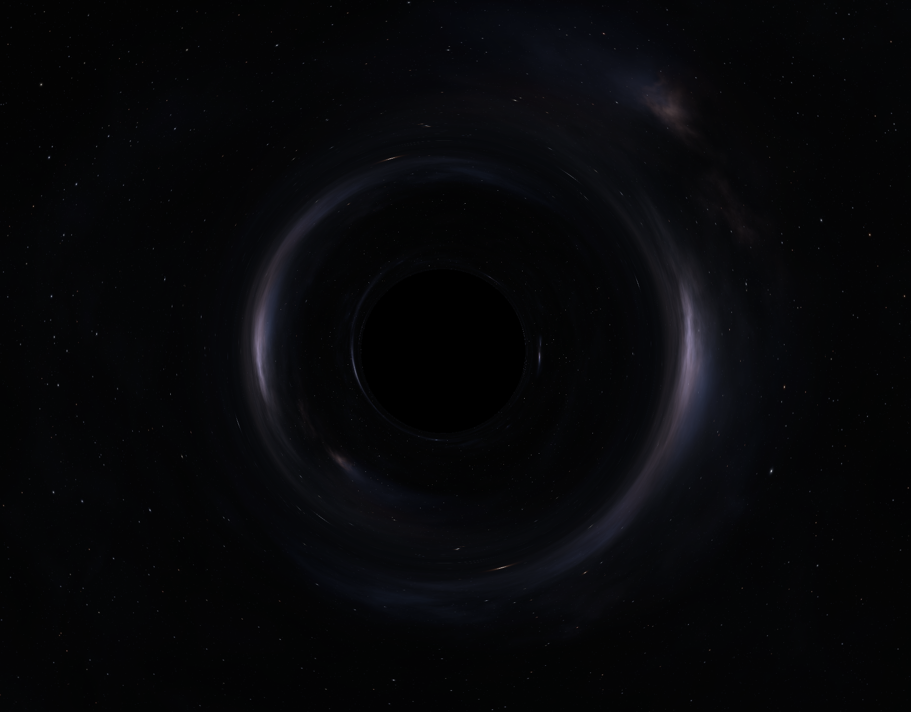
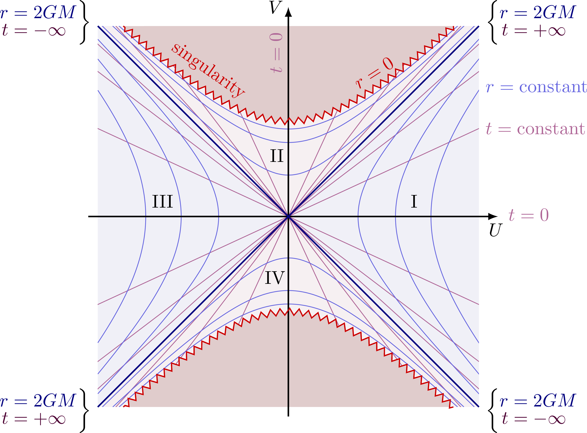

# Schwarzschild Black Hole Simulation



### Build Instructions

I use my own rendering framework, [Groot Rendering Framework](https://hipp.cloud/groothipp/Groot-Rendering-Framework/), to do all of the GPU work in this project. You will need to install this to build the simulation on your own computer. Other than that its standard CMake procedure:

```
cmake -B build
cmake --build build
build/black_hole
```

### Theory

#### Relativity

Einstein published his theory of general relativity in 1915. It is a theory built upon an addition to the Galilean relativistic principles: the existence of a maximum signal speed between two events (the speed of light). With this, time became a coordinate in a four-dimensional spacetime that is curved by the matter that exists inside of it. At the core of this are Einstein's field equations:

$$ R_{\mu\nu} - \dfrac{1}{2}Rg_{\mu\nu} + \Lambda g_{\mu\nu} = 8\pi T_{\mu\nu} $$

> Note that I am using natural units ($G = c = 1$)

Einstein believed that his equations were unsolvable. However, not long after his paper had been published he received a letter from Karl Schwarzschild containing a solution that describes the spacetime around a spherical, non-rotating mass. This solution is the well-known Schwarzschild metric, denoted by the interval:

$$ ds^2 = -(1 - \dfrac{r_s}{r})dt^2 + (1 - \dfrac{r_s}{r})^{-1}dr^2 + r^2d\theta^2 + r^2\sin^2\theta d\phi^2 $$

$r_s$ is called the Schwarzschild radius, and it denotes the radius of the black hole's event horizon, the point at which spacetime flows into $r=0$, the black hole's singularity, faster than the speed of light -- meaning that nothing can escape its pull.

The problem that plagued physicists was the two singular values of $r$: $r = r_s$ and $r = 0$. Both of these values resulted in a term blowing up to infinity, which in physics is deemed a breakdown in the theory as infinities are seen as unphysical.

Upon further analysis of the Schwarzschild metric, physicists were able to show that $r = r_s$ was a product of a bad choice of coordinates. This led to Kruskal-Szekeres (KS) coordinates given by:

$$ \dfrac{4r_s^3}{r}e^{-\dfrac{r}{r_s}}(dT^2 - dR^2) - r^2d\theta^2 - r^2\sin^2\theta d\phi^2 $$

These coordinates maximally extended the Schwarzschild solution, showing that the event horizon is crossable and that $r = 0$ is a true singularity. In fact, it split up the Schwarzschild solution into four regions as shown below:


> Image from [tikz.net](https://tikz.net/relativity_kruskal_diagram/)

Region 1 corresponds to the region of spacetime of an observer outside of the event horizon. Region 2 corresponds to the region of spacetime inside of the black hole. All diagonal lines correspond to ingoing / outgoing light. As you can see, when inside of the event horizon light can never cross back outside of the event horizon and is destined to eventually contact the singularity (denoted by the squiggly red hyperbola).

Region 4 predicts the existence of white holes. These are the exact opposite of black holes in that light can escape the event horizon into region 1 but can never cross back into region 4.

Region 3 is a parallel spacetime to region 1. The only way for us to get from region 1 to region 3 is through a wormhole (called an Einstein-Rosen bridge for the case of a Schwarzschild black hole). For these types of black holes, wormholes are extremely unstable and it is physically impossible for an observer in region 1 to cross over to region 3 and vice versa. However, for other black holes that are rotating, charged, or both, there are physical ways of crossing between the parallel regions which, in my non-professional opinion, is super neat.

The issue with KS coordinates is that the time coordinate, $T$, isn't really physical for an observer. It is a mix of the $t$ and $r$ coordinates and thus doesn't really correspond to an observer's proper time -- meaning that they won't really see the spacetime unfold in terms of $T$. So, it would be best to use a coordinate system that allows us to not only remove the $r = r_s$ singular point but also view the black hole from the perspective of an observer free-falling around it.

This is where Gullstrand-Painlevé (GP) coordinates come in. It is a coordinate system that keeps space flat around the observer, and instead manifests the spacetime curvature entirely through a time-radial relationship. The GP interval is as follows:

$$
  ds^2 = -(1 - \dfrac{r_s}{r})dT^2 + \sqrt{\dfrac{4r_s}{r}}dTdr + dr^2 + r^2d\theta^2 + r^2\sin^2\theta d\phi^2
$$

#### Path Tracing

The way to think about ray tracing if you haven't developed a ray tracer before is to view the center of your screen as the starting point of your light rays. Then, you shoot light out from the center and in the direction of each pixel on the screen. From there, the light travels and you eventually sample a color from wherever it ends up.

You apply this same concept when tracing light through spacetime, except this time the path of the light follows the geodesics of the spacetime you are in, aka the shortest path along the surface you are traveling on. The most general way to describe these geodesics is the geodesic equation:

$$ \dfrac{du^{\rho}}{d\lambda} + \Gamma^{\rho}_{\mu\nu}u^{\mu}u^{\nu} = 0 $$

$u^{\rho}$ is the photon's 4-velocity, $\lambda$ is an affine parameter (photons have no proper time to parameterize by, so we use $\lambda$ instead), and $\Gamma^{\rho}_{\mu\nu}$ are the metric's Christoffel symbols -- corrections to derivatives that account for the curvature of the space you are in.

My first implementation integrated this equation directly: evaluate all of the non-zero Christoffel symbols of the GP metric at every step, for every pixel, every frame. It worked, but it was nowhere near real time. The symbols are full of square roots and divisions, Euler integration needs very small steps to stay stable near the black hole, and all of that work gets repeated hundreds of times per pixel. The fix isn't to compute the symbols faster -- it's to use the symmetries of the spacetime so that they never show up in the first place.

#### Symmetry Reduction

Here is the observation that makes the whole simulation real time: the shape of a geodesic is a property of the spacetime, not of the coordinates you describe it in. The Christoffel symbols are coordinate bookkeeping. If some coordinate system reveals a simpler structure in the geodesics, that structure is available to us no matter what coordinates the camera math uses.

Schwarzschild spacetime is spherically symmetric and static, and by Noether's theorem each of those symmetries hands us a conserved quantity along every geodesic:

$$
\begin{aligned}
	E &= (1 - \dfrac{r_s}{r})\dfrac{dt}{d\lambda} \\
	L &= r^2\dfrac{d\phi}{d\lambda}
\end{aligned}
$$

Spherical symmetry also means every photon orbit never leaves the plane spanned by its position vector and its direction of travel. So without loss of generality we can put the orbit in the equatorial plane ($\theta = \frac{\pi}{2}$) and the 4D problem collapses down to 2D.

Now we apply the null condition, $g_{\mu\nu}u^{\mu}u^{\nu} = 0$, which for the equatorial Schwarzschild metric reads:

$$ -(1 - \dfrac{r_s}{r})(\dfrac{dt}{d\lambda})^2 + (1 - \dfrac{r_s}{r})^{-1}(\dfrac{dr}{d\lambda})^2 + r^2(\dfrac{d\phi}{d\lambda})^2 = 0 $$

Substituting in $E$ and $L$, then trading $r$ for $u = \frac{1}{r}$ and $\lambda$ for $\phi$ (using $\frac{dr}{d\lambda} = -L\frac{du}{d\phi}$), the whole thing collapses to:

$$ (\dfrac{du}{d\phi})^2 = \dfrac{1}{b^2} - u^2 + r_su^3 $$

where $b = \frac{L}{E}$ is the impact parameter. Differentiate once with respect to $\phi$ and $b$ drops out entirely:

$$ \dfrac{d^2u}{d\phi^2} + u = \dfrac{3}{2}r_su^2 $$

This is the entire content of the geodesic equation for light around a Schwarzschild black hole. One scalar ODE. The right hand side is the general-relativistic correction -- set $r_s = 0$ and you get $u'' + u = 0$, whose solutions are straight lines, exactly as they should be in flat space.

> Notice what's missing: $t$. The equation only describes the shape of the path, $r(\phi)$. The infamous $r = r_s$ pathology of Schwarzschild coordinates lives entirely in how coordinate time relates to $\lambda$ -- and since rendering never needs $t$, the shape equation is perfectly regular straight through the event horizon. This is why we get to keep the horizon-crossing camera even though we derived the equation in Schwarzschild coordinates: GP and Schwarzschild coordinates share the exact same $(r, \theta, \phi)$, so the paths are identical point sets in both charts.

We could integrate $u(\phi)$ directly, but there is an even more convenient form. In classical mechanics, the Binet equation says that a particle moving in a plane under a central force $F(r)$ (per unit mass) obeys:

$$ \dfrac{d^2u}{d\phi^2} + u = -\dfrac{F}{h^2u^2} $$

where $h = |\vec{x} \times \vec{v}|$ is the (conserved) specific angular momentum. Matching this against our orbit equation, the photon path is exactly reproduced by fake-Newtonian motion in ordinary flat 3D space under the central force:

$$ \vec{a} = -\dfrac{3}{2}\dfrac{r_sh^2}{r^5}\vec{x} $$

This is a gift for a compute shader. The state is just a position and a velocity in Cartesian coordinates, and $h^2$ is computed once per ray from the initial conditions.

#### Tetrads

There is still the question of how to turn a pixel into an initial condition, and this is where GP coordinates come in to play. The camera's forward vector lives in its local flat-space frame, and we need a tetrad $e^{\mu}_{\hat{a}}$ to translate local directions into the global chart, defined by:

$$ g_{\mu\nu}e^{\mu}_{\hat{a}}e^{\nu}_{\hat{b}} = \eta_{\hat{a}\hat{b}} $$

The natural observer of GP coordinates is someone who fell from rest at infinity. Their tetrad has the non-zero components:

$$
\begin{aligned}
	e^T_{\hat{T}} &= 1 \\
	e^r_{\hat{T}} &= -\sqrt{\dfrac{r_s}{r}} \\
	e^r_{\hat{r}} &= 1 \\
	e^{\theta}_{\hat{\theta}} &= \dfrac{1}{r} \\
	e^{\phi}_{\hat{\phi}} &= \dfrac{1}{r\sin\theta}
\end{aligned}
$$

You can verify against the GP metric that $g(e_{\hat{T}}, e_{\hat{T}}) = -(1 - \frac{r_s}{r}) - 2\frac{r_s}{r} + \frac{r_s}{r} = -1$, with the cross term cancelling exactly.

For the initial condition, trace backward. The light we render arrived at the camera, so we follow its geodesic into the past. A photon arriving from the pixel direction $\hat{d}$ has local 4-velocity $v^{\hat{a}} = (1, -\hat{d})$ (null in the flat frame, moving toward the camera). Pushing it through the tetrad and flipping the sign to get the past-directed tangent, the spatial part comes out to:

$$ \vec{v} = \hat{d} + \sqrt{\dfrac{r_s}{r}}\hat{r} $$

This results in the following simple tetrad behavior in the trace shader:

```glsl
vec3 rhat = camPos / camR;
vec3 v    = rayDir + sqrt(rs / camR) * rhat;
```

You can confirm the behavior by considering a few cases. Far from the black hole, the correction vanishes and it just acts as an ordinary path tracer. When looking straight down on the horizon, you get a degenerate ray, $\vec{v} = -hat{r} + \hat{r} = 0$ which generates the horizon. This is colored black of course. Just inside the horizon you get $\sqrt{\frac{r_s}{r}} > 1$ so every backward ray will tilt outward meaning that all of the light reaching you also fell into the black hole which is why the sky doesnt disappear when you cross inside.

#### Integration

Each pixel then runs RK4 on $(\vec{x}, \vec{v})$ with $\vec{a} = -\frac{3}{2}r_sh^2\vec{x}/r^5$. The step size adapts to where the physics actually happens:

$$ d\lambda = k \cdot \dfrac{r}{1 + \dfrac{r_sh^2}{r^3}} $$

The numerator takes big steps far from the hole where rays are nearly straight. The denominator shrinks the step near the photon sphere ($r = \frac{3}{2}r_s$), where orbits are unstable and integration error explodes.

The loop terminates when:

1. $r$ falls below a small threshold. When traced backward, this light would have had to come out of the past singularity. The pixel is colored black.
2. $r$ exceeds a large threshold while moving outward. The ray escaped, and the spheremap is sampled to get the color of the pixel.
3. The step budget runs out. The ray is stuck orbiting the photon sphere so it never reaches the observer. The pixel is colored black.
